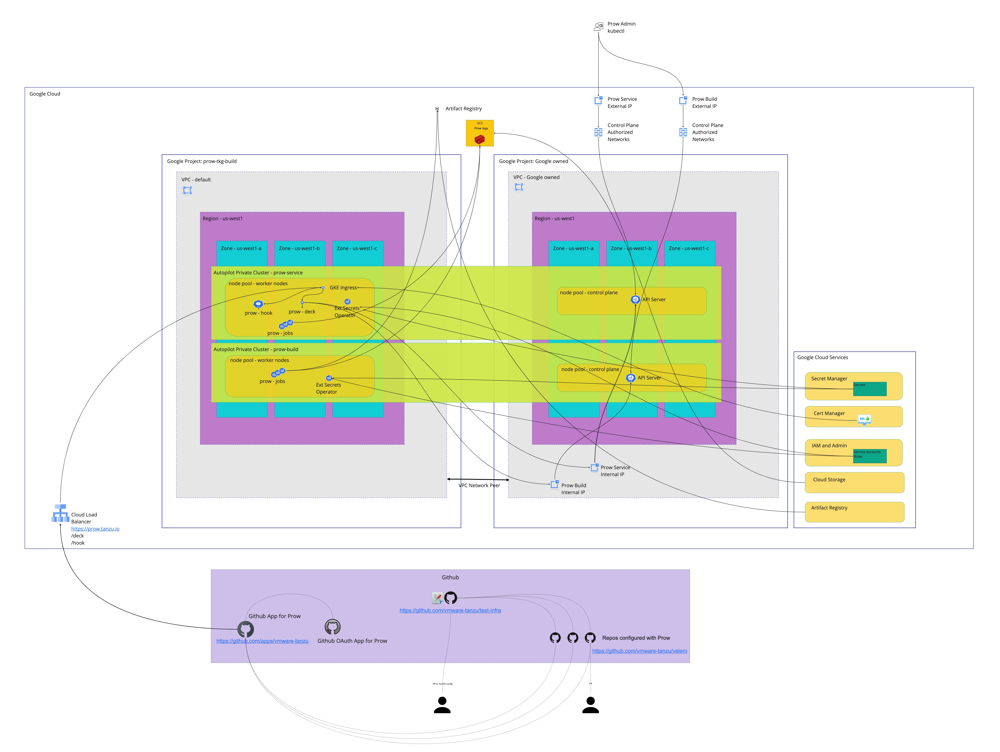

# Prow Architecture

The document outlines Prow architecture and interconnections between different systems and components that are involved in it.

The primary Prow clusters (prow-service and prow-gke-build) are Kubernetes instance managed by Google Kubernetes Engine (GKE) as part of the Google Cloud Platform (GCP) project called `prow-tkg-build`.  The clusters are private clusters built with Autopilot.

There also will be Prow build clusters as needed in various clouds: AWS, vSphere, and Azure.  EKS in AWS is the first non-GKE build cluster to be created.  This cluster will be used for TCE on AWS E2E testing.

Most Prow Jobs will be run within build clusters separate from the Prow service cluster (the cluster where the Prow components live). Any 'trusted' jobs that require secrets or services that should not be exposed to presubmit jobs, such as publishing or deployment jobs, should run in a different cluster from the rest of the 'untrusted' jobs. The Prow service cluster will be reused as a build cluster for these 'trusted' jobs since they are typically fast and few in number.

See an overview of the Prow production clusters, their components, and interactions with GitHub repositories and GCP.

## Provisioning and Secrets
Provisioning is automated where possible with scripting.  Automation is an ongoing task and improved continually.  For each cloud environment, we have guides that outline the processes and procedures for creating the Prow environment.

For both GKE and EKS, secrets are created within a cluster using [External Secrets Operator](https://external-secrets.io/).  Raw secrets are stored in the cloud provider's Secret Manager and retrieved by the External Secrets Operator which then creates Kubernetes secrets.  The External Secrets Operator is granted rights to read the cloud provider's Secret Manager via a Kubernetes Service Account that is linked to a cloud provider IAM service account.

Kubernetes secrets are also used to grant rights to test pods in build clusters to do things like write to a registry or build an E2E test bed.  These are accessed by jobs using Prow presets [Prow presets](./presets.md)

> **NOTE:** For more information on Secret management, read the [Prow Secrets Management](./prow-secrets-management.md) document.

## Components
Prow components access build servers using kubeconfig files that are stored in a secret.  Each build cluster's API Server endpoint is protected by a firewall policy that only grants access to specific IP CIDR ranges.

### Crier
Crier takes care of reporting the status of Prow job to the external services like GitHub and Slack. For more information, read [crier.md](./crier.md).

### Deck
Deck is exposed through an Ingress definition which has TLS enabled using a certificate issued for `prow.tanzu.io`.  The path for Deck is: `https://prow.tanzu.io/`. Deck serves a UI that you can access as an anonymous user to view build statuses. Deck can only view and list the jobs and the job logs.

### Hook
Hook is exposed through the same Ingress as Deck using a different path which is `https://prow.tanzu.io/hook`. It listens for GitHub events triggered by the external GitHub system. The external address to the Hook component gets configured in GitHub as a webhook using a token as a Secret. That token gets generated during the provisioning process and is configured for the Hook component. Hook calls the installed plugins on receiving a GitHub event.

### Prow-controller-manager
Prow-controller-manager (formerly "Plank") checks regularly if there are new Prow job resources, executes the related job, and applies the Pod specification to the cluster. A Prow job gets created usually by the Trigger plugin based on an event from GitHub, or periodically by the Horologium component.

### Horologium
Horologium triggers periodic jobs from the `job` folder based on a predefined trigger period.

### Sinker
Sinker scans for jobs older than one day and cleans up their Pods.

### Branch Protector
Branch Protector is a Prow component that is responsible for defining branch protection settings on GitHub repositories. It updates protection settings on GitHub repositories every 30 minutes. It takes configuration from the `config.yaml` file on the cluster.

### Tide
Tide is a Prow component that automatically checks the acceptance criteria against opened PRs in the repository. If the given PR passes all the criteria, Tide automatically merges it.

## Plugins
There are different kinds of plugins that react to GitHub events forwarded by the Hook component. Plugins are configured per repository using `plugins.yaml`.
For more information about installed plugins in the `vmware-tanzu` organization, refer to the [plugins.yaml](../../prow/plugins.yaml) file.

## Prow jobs
Different build jobs are specified in the `jobs` folder. Each of them uses different kind of trigger conditions. Depending on the trigger, a component becomes active to create a Prow-specific Prow job resource that represents a given job execution. At a later time, a real Pod gets created by the Plank based on the Pod specification provided in the `jobs` folder. Inside the Pod, a container executes the actual build logic. When the process is finished, the Sinker component cleans up the Pod.

## Dynamic provisioning using GKE, Google Compute Engine (GCE), or AWS
The integration job performs integration tests against real clusters. To achieve this, it creates and deletes TCE clusters on the cloud provider. The integration job use a Kubernetes service account that is linked to dedicated cloud service account that grants it the required roles and profiles required to allocate resources.

## Publish images to Google Artifact Registry
Every job can have a Secret configured to upload Docker images to the designated Artifact Registry. That Secret belongs to a dedicated Google service account.
Prow in vmware-tanzu uses the Docker-in-Docker (dind) approach to build a Docker image as part of a job.

## Build logs on GCS
Build logs are archived by Plank on GCS in a dedicated bucket. The bucket is configured to have a Secret with a dedicated Google service account for GCS.

## Generate development artifacts
TBD
